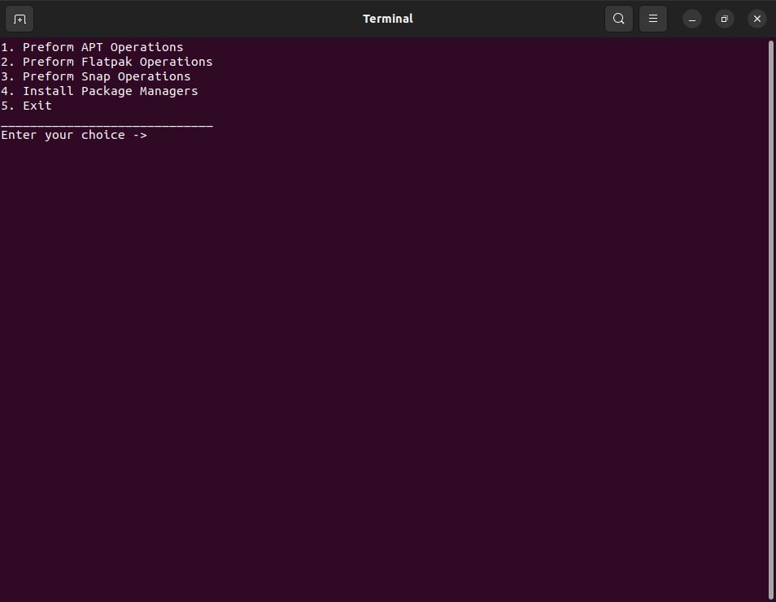

# UniPak 🚀


<p align="center">
  
  <!-- Or use: https://raw.githubusercontent.com/KPR-MAN/UniPak/main/uni_pak_icon.png -->
</p>

**UniPak (Universal Package Manager) simplifies managing software on APT-based Linux distributions. It provides a unified, number-based interface for `apt`, `snap`, and `flatpak`, allowing you to install, update, and remove packages without needing to memorize different commands for each!**

## Table of Contents

- [✨ Features](#-features)
- [🤔 Why UniPak?](#-why-unipak)
- [🖼️ Screenshot](#️-screenshot)
- [🎯 Target Audience & System](#-target-audience--system)
- [🧩 Supported Package Managers](#-supported-package-managers)
- [📋 Prerequisites](#-prerequisites)
- [🚀 Installation](#-installation)
- [🛠️ Usage](#️-usage)
- [🤝 Contributing](#-contributing)
- [📜 License](#-license)

## ✨ Features

*   **Unified Interface:** Interact with `apt`, `snap`, and `flatpak` through a single, consistent command-line tool.
*   **Number-Based Selection:** No need to remember specific flags or syntax; just choose options from a numbered list.
*   **Simplified Workflow:** Streamlines common package management tasks (install, update, remove, search) across supported managers.
*   **Beginner-Friendly:** Designed to lower the barrier to entry for managing key package types on APT-based systems.

## 🤔 Why UniPak?

On APT-based systems like Ubuntu or Debian, users often encounter `apt` for system packages, but also `snap` and `flatpak` for broader application availability. Remembering the distinct commands for each (`apt install`, `snap install`, `flatpak install`, etc.) can be cumbersome. UniPak abstracts this complexity, allowing you to manage software from these three important sources using a simple numerical menu.

## 🖼️ Screenshot

<p align="center">
  
  <!-- Or use: https://raw.githubusercontent.com/KPR-MAN/UniPak/main/screenshots/UniPak_Screenshot.png -->
</p>

## 🎯 Target Audience & System

*   **Operating System:** Designed exclusively for **APT-based Linux distributions** (e.g., Ubuntu, Debian, Linux Mint, and their derivatives).
*   **Users:** Ideal for users who want a simplified way to manage `apt`, `snap`, and `flatpak` packages without juggling multiple command syntaxes.

## 🧩 Supported Package Managers

UniPak currently simplifies interaction with the following package managers on APT-based systems:

*   **APT** (Advanced Package Tool)
*   **Snap**
*   **Flatpak**

## 📋 Prerequisites

Before installing UniPak, ensure you have the following:

*   **An APT-based Linux distribution** (e.g., Ubuntu, Debian, Linux Mint). This is essential.
*   **The `apt`, `snapd` (for Snap support), and `flatpak` command-line tools installed and functional on your system.** UniPak relies on these underlying managers.
*   **Python 3.7+** installed.
*   **pip** (Python package installer).
*   **PyInstaller:** Required by the `UniPak_Installer.py` script.
    *   You can install PyInstaller using pip:
        ```bash
        pip install pyinstaller
        ```


## 🚀 Installation

Follow these steps to get UniPak up and running:

1.  **Get the UniPak Files:**

    *   **Option A: Download Latest Release (Recommended for most users)**
        1.  Go to the [**UniPak Releases page**](https://github.com/KPR-MAN/UniPak/releases).
        2.  Under the **latest release**, download the `Source code (zip)` or `Source code (tar.gz)` file from the "Assets" section.
        3.  Extract the downloaded archive to a location on your computer.
        4.  Navigate into the extracted directory. The directory name will likely be `UniPak-<version_number>` (e.g., `UniPak-1.0.0`).
            ```bash
            # Example after extracting UniPak-1.0.0.zip:
            # cd UniPak-1.0.0
            ```

    *   **Option B: Clone the Repository (For developers or to get the very latest changes)**
        This will give you the most up-to-date code, which might include unreleased features or bug fixes.
        ```bash
        git clone https://github.com/KPR-MAN/UniPak.git
        cd UniPak
        ```

2.  **Run the Installer Script:**
    Once you are inside the UniPak project directory (either from the extracted release or the cloned repository), execute the `UniPak_Installer.py` script:
    ```bash
    python3 UniPak_Installer.py
    ```
    Please wait for the installation process to complete.

3.  **Done!**
    UniPak should now be installed. You can typically open UniPak from your system's applications menu or by a command if the installer adds it to your PATH.

## 🛠️ Usage

1.  Launch UniPak (e.g., from your applications menu).
2.  You'll be presented with a menu of package managers (`apt`, `snap`, `flatpak`). Select one using its number.
3.  Follow the subsequent on-screen numerical prompts to:
    *   Search for packages.
    *   Install new packages.
    *   Update existing packages.
    *   Remove installed packages.
    *   Perform other available actions for the selected manager.

## 🤝 Contributing

Contributions are welcome! If you have ideas for improvements, new features, or bug fixes, please feel free to:

1.  Fork the repository.
2.  Create a new branch (`git checkout -b feature/YourAmazingFeature`).
3.  Make your changes.
4.  Commit your changes (`git commit -m 'Add some AmazingFeature'`).
5.  Push to the branch (`git push origin feature/YourAmazingFeature`).
6.  Open a Pull Request.

Please ensure your code aligns with the project's focus on APT-based systems and the supported package managers.

## 📜 License

This project is licensed under the **MIT License**. See the [LICENSE](LICENSE.md) file for details.
